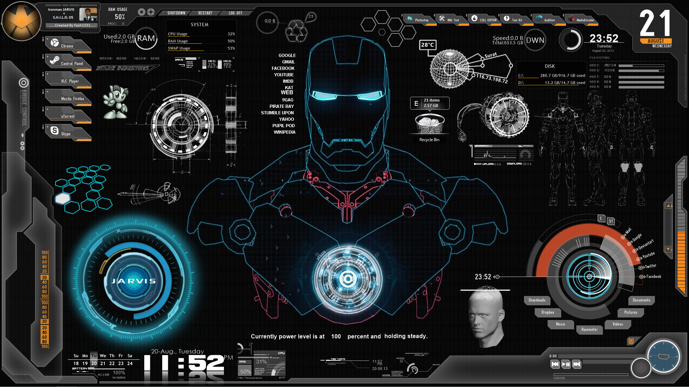

# J.A.R.V.I.S<br>
Iron man inspired Personal virtual assistant<br>
[Website](https://kkshitiz.github.io/J.A.R.V.I.S/)



### Vision:
 To make an advanced personal voice assistant capable of responding to user's voice and perform tasks accordingly.

### Background Readings:
- [Is Iron Man jarvis still a fiction?]("https://medium.com/@froger_mcs/iron-mans-jarvis-is-it-still-a-fiction-972c337294de")
- [Two Indian Men create Jarvis OS]("https://www.indianweb2.com/2014/07/28/two-indians-made-iron-mans-jarvis-ai-reality/")
- [Mark Zunckerberg's blog on Jarvis]("https://www.facebook.com/notes/mark-zuckerberg/building-jarvis/10103347273888091/?pnref=story")
- [An in-depth analysis of Jarvis by a professional]("https://www.linkedin.com/pulse/how-studying-ai-ruins-marvel-movies-you-tony-starks-jarvis-feroli/")

### Inspiration:


__NOTE:  _In the initial stage the project will be limited to the software part_.__
Some points:
- First goal would be to create a weak AI.<br>
[Here's a quick read about Weak Vs Strong A.I.]("https://e3zine.com/strong-artificial-intelligence/")<br>
- Although some of the features described below would seem overblown but they actually exists. The challenge here is to tweak it to our desired outcome and integrate the individual features and modules.
<br>

### This project structure is proposed as follows:
  - #### Hardware
    - ##### RFID scanner
    - ##### IoT
      - Light bulbs
      - TVs
      - Nest
      - Thermostats
      - CCTVs
      - Speakers
      - Other devices
      [Here's a link on Home Automation]("https://www.youtube.com/watch?v=bE9NhWMTK1E")
  - #### Software
    - ##### Artificial Intelligence components
      - Natural Language Processing
        - Speech to Text
        - Text to Speech
        - Chatbot capabilities
      - Computer Vision
        - Face Detection
        - Face REcognition
        - Eye Tracking
        - Object detection
        - Extracting text from images
        - Visual question answering
        - Expression recognition
        - Hand gesture recognition
    - ##### Non AI / Hard-Coded components
      - System based functions(which changes or reads the state of hardware)
        - Media playback
          - Play/Pause media
          - control volume output
          - Previous/Next 
          - Mute volume
        - Power options
          - shutdown
          - restart
          - above functions with a timer
        - system hardware functions
          - check ram
          - chack cpu
          - check battery
      - Network based functions
        - opening websites
        - fetching events from google calendar
        - fetching weather of a region
        - translating from one language to another
        - search on google,wikipedia,youtube for a query
        - answering STEM related and complex computational questions using wolfram alpha api
        - send emails using voice command
        - scraping the web
      - Offline non-system functions
        - save notes from user
        - take screenshots
        - play music from local system
        - telling jokes
        - virtual key clicks
        - editing mode
        - telling time and date
        - setting up reminders, alarms or timers
        - Open up applications
        - ability to add coded responses using voice

    - ##### Desktop GUI application
      - alternative to voice controlled actions
      - user login to change settings
      - Futuristic animations
      - monitor all the functions of jarvis
      - manual control of jarvis features

    - ##### App based interaction module / Messenger Bot
      - to indirectly communicates with the rest of the Hardware and Software components from anywhere


### How to start working :
- Fork the repository
- Clone it
- Work on it
- pull changes
- push the code
- Submit pull requests

### How to get it running:
- Clone it
- open terminal in linux based system or git bash in windows
- navigate to the directory
- command: bash install_requirements.sh

### NOTE to contributors:
_Use Python3 for development_
- Currently the features are built and tested in windows environment so some of the features may not work on other platforms
- Pls try to add the missing feature for the platform you are using
- Try to write clean code with comments and descriptive variable names
- Divide the work into small modules
- Update the install_requirements.sh and requirements.txt files as and when required
- Feel free to improvise this README
- Commit as frequently as possible

* ***Please do not make this repository public unless discussed otherwise.***
* ***Update readme files as and when required.***
* ***Readme files inside the subfolders can be used to keep a track of:***
  * Work done till now
  * To do lists
  * Libraries and dependencies required
  * Any other metadata


### Project directory structure

```bash
│   .gitignore
│   install_requirements.sh
│   LICENSE
│   main.py
│   README.md
│   requirements.txt
│   token.pickle
│   _config.yml
│
├───assets
│   │   README_assets.md
│   │
│   ├───images
│   │       J.A.R.V.I.S..jpg
│   │       jarvis.jpg
│   │
│   ├───music
│   │       AC DC - BACK IN BLACK MUSIC WITH.mp3
│   │       AC DC - Hard As A Rock (Official Video).mp3
│   │       AC DC - Shoot To Thrill (Iron Man 2 Version).mp3
│   │       AC DC - War Machine.mp3
│   │       AC DC Highway to hell Letra.mp3
│   │       ACDC-You-Shook-Me-All-Night-Long.mp3
│   │       Another One Bites The Dust - Queen.mp3
│   │       Metallica-Master Of Puppets.mp3
│   │       T.N.T..mp3
│   │       The Clash - Should I Stay Or Should I Go.mp3
│   │       Warrant - Cherry Pie (with).mp3
│   │
│   ├───notes
│   │       2020-04-01 14-41-15.199146-note.txt
│   │       2020-04-02 13-37-21.929309-note.txt
│   │
│   ├───screenshots
│   │       image.png
│   │
│   └───sounds
│           end.wav
│           jarvislistening.wav
│           jarvisworking.wav
│           start.wav
│
├───gui
│       README_gui.md
│
├───hardware
│       README_utility.md
│
├───software-bot
│       README_bot.md
│
├───software_AI
│   ├───computer-vision
│   │       README_utility.md
│   │
│   └───natural-language-processing
│       │   action_phrases.py
│       │   conversational_phrases.txt
│       │   playmusic.py
│       │   playsounds.py
│       │   README_nlp.md
│       │   speech2text.py
│       │   text2speech.py
│       │
│       └───__pycache__
│               action_phrases.cpython-37.pyc
│               playmusic.cpython-37.pyc
│               playsounds.cpython-37.pyc
│               speech2text.cpython-37.pyc
│               text2speech.cpython-37.pyc
│
├───software_Non_AI
└───utility
    │   credentials.json
    │   googlecalendar.py
    │   miscutils.py
    │   README_utility.md
    │   screenshot.py
    │   sysutils.py
    │   translate.py
    │   webbrowser_functions.py
    │   wolfram.py
    │
    ├───systemcontrols
    │   │   key.py
    │   │   keyboard.py
    │   │   systemcontrol.py
    │   │   type.py
    │   │
    │   └───__pycache__
    │           key.cpython-37.pyc
    │           keyboard.cpython-37.pyc
    │           sound.cpython-37.pyc
    │           systemcontrol.cpython-37.pyc
    │
    └───__pycache__
            googlecalendar.cpython-37.pyc
            keyboard.cpython-37.pyc
            miscutils.cpython-37.pyc
            screenshot.cpython-37.pyc
            sound.cpython-37.pyc
            sysutils.cpython-37.pyc
            wolfram.cpython-37.pyc
```

### How to update/regenerate the directory structure easily:
  - navigate to the directory J.A.R.V.I.S
  - issue the command tree /F in cmd/powershell
  - or in terminal
    - sudo apt install tree
    - tree
  - copy the result
  - replace the existing structure inside the bash code container above

### Related projects on JARVIS:
  - Student Group called Hacker Labs create real Iron Man Helmet with working HUD using MS Hololens<br>
    
  - Hacksmith makes JARVIS Home Automation in real life
    
    

<hr>

*For help with writing markdown visit [this page](https://guides.github.com/features/mastering-markdown/)*<br>
*You can use emojis too, take reference from [here](https://github.com/ikatyang/emoji-cheat-sheet)*<br>
